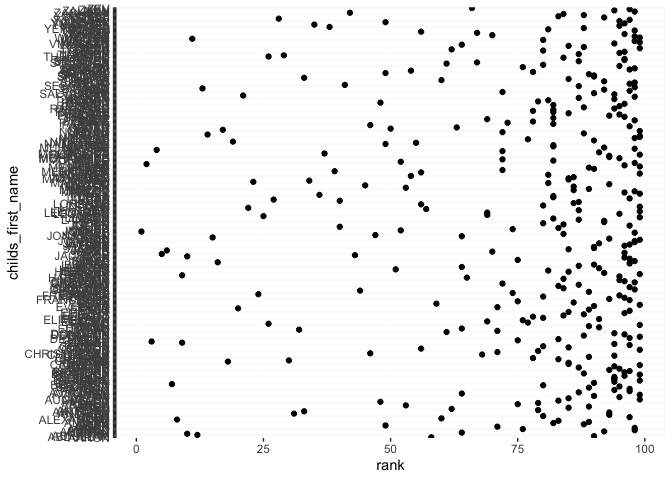

Homework 2
================
Alice Tivarovsky
9/26/2019

# Problem 1

## Mr Trash Wheel Data

We are reading in the Mr. Trash Wheel dataset, stored as an excel file.
We will remove the last column, which contains notes.

``` r
knitr::opts_chunk$set(echo = TRUE)

library(tidyverse)
```

    ## ── Attaching packages ───────────────────────────────────────────── tidyverse 1.2.1 ──

    ## ✔ ggplot2 3.2.1     ✔ purrr   0.3.2
    ## ✔ tibble  2.1.3     ✔ dplyr   0.8.3
    ## ✔ tidyr   1.0.0     ✔ stringr 1.4.0
    ## ✔ readr   1.3.1     ✔ forcats 0.4.0

    ## ── Conflicts ──────────────────────────────────────────────── tidyverse_conflicts() ──
    ## ✖ dplyr::filter() masks stats::filter()
    ## ✖ dplyr::lag()    masks stats::lag()

``` r
library(readxl)

# Importing Mr Trash Data
mr_trash_data = read_excel("../data/mr_trash_dataset.xlsx")
```

    ## New names:
    ## * `` -> ...15
    ## * `` -> ...16
    ## * `` -> ...17

``` r
mr_trash_data = janitor::clean_names(mr_trash_data)

# Removing last column of comments
mr_trash_data = select(mr_trash_data, -x15, -x16, -x17)
mr_trash_data
```

    ## # A tibble: 406 x 14
    ##    dumpster month  year date                weight_tons volume_cubic_ya…
    ##       <dbl> <chr> <dbl> <dttm>                    <dbl>            <dbl>
    ##  1        1 May    2014 2014-05-16 00:00:00        4.31               18
    ##  2        2 May    2014 2014-05-16 00:00:00        2.74               13
    ##  3        3 May    2014 2014-05-16 00:00:00        3.45               15
    ##  4        4 May    2014 2014-05-17 00:00:00        3.1                15
    ##  5        5 May    2014 2014-05-17 00:00:00        4.06               18
    ##  6        6 May    2014 2014-05-20 00:00:00        2.71               13
    ##  7        7 May    2014 2014-05-21 00:00:00        1.91                8
    ##  8        8 May    2014 2014-05-28 00:00:00        3.7                16
    ##  9       NA May …    NA NA                        26.0               116
    ## 10        9 June   2014 2014-06-05 00:00:00        2.52               14
    ## # … with 396 more rows, and 8 more variables: plastic_bottles <dbl>,
    ## #   polystyrene <dbl>, cigarette_butts <dbl>, glass_bottles <dbl>,
    ## #   grocery_bags <dbl>, chip_bags <dbl>, sports_balls <dbl>,
    ## #   homes_powered <dbl>

The “raw” dataframe contains 406 entries and 14 columns.

We will now remove any rows that have dumpster = NA and convert the
column “sports\_balls” to an integer vector rounded to the nearest whole
number.

``` r
# Removing rows with "NA" for dumpster
mr_trash_data = drop_na(mr_trash_data, dumpster)

# Rounding sports_balls to nearest integer
mr_trash_data = mutate(mr_trash_data, sports_balls = round(as.integer(sports_balls, digits = 0)))
mr_trash_data
```

    ## # A tibble: 344 x 14
    ##    dumpster month  year date                weight_tons volume_cubic_ya…
    ##       <dbl> <chr> <dbl> <dttm>                    <dbl>            <dbl>
    ##  1        1 May    2014 2014-05-16 00:00:00        4.31               18
    ##  2        2 May    2014 2014-05-16 00:00:00        2.74               13
    ##  3        3 May    2014 2014-05-16 00:00:00        3.45               15
    ##  4        4 May    2014 2014-05-17 00:00:00        3.1                15
    ##  5        5 May    2014 2014-05-17 00:00:00        4.06               18
    ##  6        6 May    2014 2014-05-20 00:00:00        2.71               13
    ##  7        7 May    2014 2014-05-21 00:00:00        1.91                8
    ##  8        8 May    2014 2014-05-28 00:00:00        3.7                16
    ##  9        9 June   2014 2014-06-05 00:00:00        2.52               14
    ## 10       10 June   2014 2014-06-11 00:00:00        3.76               18
    ## # … with 334 more rows, and 8 more variables: plastic_bottles <dbl>,
    ## #   polystyrene <dbl>, cigarette_butts <dbl>, glass_bottles <dbl>,
    ## #   grocery_bags <dbl>, chip_bags <dbl>, sports_balls <dbl>,
    ## #   homes_powered <dbl>

## Precipitatin Data

We will now import and clean 2017, 2018, and 2019 precipitation data
from the Mr. Trash Wheel excel file.

``` r
# Importing 2017, 2018, and 2019 precipitation data. Skipping first row

precip_data_19 = 
  read_excel("../data/mr_trash_dataset.xlsx",4, skip = 1) %>% 
  janitor::clean_names()

precip_data_18 = 
  read_excel("../data/mr_trash_dataset.xlsx",5, skip = 1) %>% 
  janitor::clean_names()

precip_data_17 = 
  read_excel("../data/mr_trash_dataset.xlsx",6, skip = 1) %>% 
  janitor::clean_names()
```

We note that the 2017 and 2018 datasets are complete, but the 2019
dataset is missing values for July - December. We also note that all
three datasets contain a row at the end with total precipitation for the
year, which we don’t need. We will omit these rows, along with the
missing values in 2019, and add a year variable before combining the
datasets.

``` r
# USE PIPE HERE AND ROUND TO TWO DECIMALS

# Removing rows with "NA" for precipation or month (i.e. the totals row) 
precip_data_19 = drop_na(precip_data_19)
precip_data_17 = drop_na(precip_data_17)
precip_data_18 = drop_na(precip_data_18)

# Renaming precipitation columns with year
precip_data_17 = rename(precip_data_17, precip_2017 = total)
precip_data_18 = rename(precip_data_18, precip_2018 = total)
precip_data_19 = rename(precip_data_19, precip_2019 = total)

precip_data_17
```

    ## # A tibble: 12 x 2
    ##    month precip_2017
    ##    <dbl>       <dbl>
    ##  1     1        2.34
    ##  2     2        1.46
    ##  3     3        3.57
    ##  4     4        3.99
    ##  5     5        5.64
    ##  6     6        1.4 
    ##  7     7        7.09
    ##  8     8        4.44
    ##  9     9        1.95
    ## 10    10        0   
    ## 11    11        0.11
    ## 12    12        0.94

``` r
precip_data_18
```

    ## # A tibble: 12 x 2
    ##    month precip_2018
    ##    <dbl>       <dbl>
    ##  1     1        0.94
    ##  2     2        4.8 
    ##  3     3        2.69
    ##  4     4        4.69
    ##  5     5        9.27
    ##  6     6        4.77
    ##  7     7       10.2 
    ##  8     8        6.45
    ##  9     9       10.5 
    ## 10    10        2.12
    ## 11    11        7.82
    ## 12    12        6.11

``` r
precip_data_19
```

    ## # A tibble: 6 x 2
    ##   month precip_2019
    ##   <dbl>       <dbl>
    ## 1     1        3.1 
    ## 2     2        3.64
    ## 3     3        4.47
    ## 4     4        1.46
    ## 5     5        3.58
    ## 6     6        0.42

Next, we will combine the precipitation data for 2017 and 2018, and
combine 2019 into the resulting dataset using a left-join since 2019
contains less data than 2017 and 2018.

``` r
precip_data =  
  left_join(precip_data_17, precip_data_18, by = "month") %>% 
  left_join(precip_data_19, by = "month")

# Converting month to character variable
precip_data =
  mutate(precip_data, month = as.numeric(month),
         month = month.name[month]) 

precip_data
```

    ## # A tibble: 12 x 4
    ##    month     precip_2017 precip_2018 precip_2019
    ##    <chr>           <dbl>       <dbl>       <dbl>
    ##  1 January          2.34        0.94        3.1 
    ##  2 February         1.46        4.8         3.64
    ##  3 March            3.57        2.69        4.47
    ##  4 April            3.99        4.69        1.46
    ##  5 May              5.64        9.27        3.58
    ##  6 June             1.4         4.77        0.42
    ##  7 July             7.09       10.2        NA   
    ##  8 August           4.44        6.45       NA   
    ##  9 September        1.95       10.5        NA   
    ## 10 October          0           2.12       NA   
    ## 11 November         0.11        7.82       NA   
    ## 12 December         0.94        6.11       NA

# Conclusion

The Mr.Trash Wheel dataset catalogs the weight, volume and categories of
trash processed by every Mr. Trash Wheel dumpster, organized by year and
month. It contains 344 observations. The precipitation dataset catalogs
precipitation in inches by month for 2017 - 2019. It contains 12
observations. The total precipitation for 2018 was 70.33 inches. The
median number of sports balls in a dumpster in 2017 was 8.

# Problem 2

# Pols Data

First, we read and clean the pols-month dataset.

``` r
pols_month = 
  read_csv(file = "../data/pols-month.csv") %>% 
  janitor::clean_names() %>% 
  separate(mon, c("year", "month", "day"), "-") %>% 
  mutate(month = as.numeric(month),
         month = month.abb[month]) %>% 
  # FIX THE PRESIDENT LOGICAL OPERATOR
  mutate(president = prez_dem == 1) %>% 
  select(-prez_dem, -prez_gop, -day)
```

    ## Parsed with column specification:
    ## cols(
    ##   mon = col_date(format = ""),
    ##   prez_gop = col_double(),
    ##   gov_gop = col_double(),
    ##   sen_gop = col_double(),
    ##   rep_gop = col_double(),
    ##   prez_dem = col_double(),
    ##   gov_dem = col_double(),
    ##   sen_dem = col_double(),
    ##   rep_dem = col_double()
    ## )

``` r
# try recode function 

pols_month
```

    ## # A tibble: 822 x 9
    ##    year  month gov_gop sen_gop rep_gop gov_dem sen_dem rep_dem president
    ##    <chr> <chr>   <dbl>   <dbl>   <dbl>   <dbl>   <dbl>   <dbl> <lgl>    
    ##  1 1947  Jan        23      51     253      23      45     198 TRUE     
    ##  2 1947  Feb        23      51     253      23      45     198 TRUE     
    ##  3 1947  Mar        23      51     253      23      45     198 TRUE     
    ##  4 1947  Apr        23      51     253      23      45     198 TRUE     
    ##  5 1947  May        23      51     253      23      45     198 TRUE     
    ##  6 1947  Jun        23      51     253      23      45     198 TRUE     
    ##  7 1947  Jul        23      51     253      23      45     198 TRUE     
    ##  8 1947  Aug        23      51     253      23      45     198 TRUE     
    ##  9 1947  Sep        23      51     253      23      45     198 TRUE     
    ## 10 1947  Oct        23      51     253      23      45     198 TRUE     
    ## # … with 812 more rows

Pols\_month contains 822 roww and 9 columns.

Next, we read and clean the snp dataset.

``` r
snp_data = 
  read_csv(file = "../data/snp.csv") %>% 
  janitor::clean_names()  %>% 
  separate(date, c("month", "day", "year"), "/") %>% 
  select(year, month, day, everything()) %>% 
  mutate(month = as.numeric(month),
         month = month.abb[month]) %>%
  arrange(year, month)
```

    ## Parsed with column specification:
    ## cols(
    ##   date = col_character(),
    ##   close = col_double()
    ## )

``` r
snp_data
```

    ## # A tibble: 787 x 4
    ##    year  month day   close
    ##    <chr> <chr> <chr> <dbl>
    ##  1 1950  Apr   3      18.0
    ##  2 1950  Aug   1      18.4
    ##  3 1950  Dec   1      20.4
    ##  4 1950  Feb   1      17.2
    ##  5 1950  Jan   3      17.0
    ##  6 1950  Jul   3      17.8
    ##  7 1950  Jun   1      17.7
    ##  8 1950  Mar   1      17.3
    ##  9 1950  May   1      18.8
    ## 10 1950  Nov   1      19.5
    ## # … with 777 more rows

The snp\_data dataset contains 787 rows.

Next, we read and clean the unemployment dataset. This entails switching
the format from wide to long

``` r
unemp_data = 
  read_csv(file = "../data/unemployment.csv") %>% 
  pivot_longer(Jan:Dec, 
             names_to = "month",
             values_to = "unemployment") %>% 
   rename(year = Year) %>% 
   mutate(year = as.character(year))
```

    ## Parsed with column specification:
    ## cols(
    ##   Year = col_double(),
    ##   Jan = col_double(),
    ##   Feb = col_double(),
    ##   Mar = col_double(),
    ##   Apr = col_double(),
    ##   May = col_double(),
    ##   Jun = col_double(),
    ##   Jul = col_double(),
    ##   Aug = col_double(),
    ##   Sep = col_double(),
    ##   Oct = col_double(),
    ##   Nov = col_double(),
    ##   Dec = col_double()
    ## )

``` r
unemp_data
```

    ## # A tibble: 816 x 3
    ##    year  month unemployment
    ##    <chr> <chr>        <dbl>
    ##  1 1948  Jan            3.4
    ##  2 1948  Feb            3.8
    ##  3 1948  Mar            4  
    ##  4 1948  Apr            3.9
    ##  5 1948  May            3.5
    ##  6 1948  Jun            3.6
    ##  7 1948  Jul            3.6
    ##  8 1948  Aug            3.9
    ##  9 1948  Sep            3.8
    ## 10 1948  Oct            3.7
    ## # … with 806 more rows

The unemp\_data dataset contains 816.

Finally, we combine the three datasets, starting by combining pols and
snp, then joining the combined dataset with the unemployment dataset.

822, 787

``` r
pols_snp = 
  left_join(pols_month, snp_data, by = c("year", "month"))
pols_snp
```

    ## # A tibble: 822 x 11
    ##    year  month gov_gop sen_gop rep_gop gov_dem sen_dem rep_dem president
    ##    <chr> <chr>   <dbl>   <dbl>   <dbl>   <dbl>   <dbl>   <dbl> <lgl>    
    ##  1 1947  Jan        23      51     253      23      45     198 TRUE     
    ##  2 1947  Feb        23      51     253      23      45     198 TRUE     
    ##  3 1947  Mar        23      51     253      23      45     198 TRUE     
    ##  4 1947  Apr        23      51     253      23      45     198 TRUE     
    ##  5 1947  May        23      51     253      23      45     198 TRUE     
    ##  6 1947  Jun        23      51     253      23      45     198 TRUE     
    ##  7 1947  Jul        23      51     253      23      45     198 TRUE     
    ##  8 1947  Aug        23      51     253      23      45     198 TRUE     
    ##  9 1947  Sep        23      51     253      23      45     198 TRUE     
    ## 10 1947  Oct        23      51     253      23      45     198 TRUE     
    ## # … with 812 more rows, and 2 more variables: day <chr>, close <dbl>

# Problem 3

Reading and tidying baby names dataset.

``` r
pop_names = 
  read_csv(file = "../data/Popular_Baby_Names.csv") %>% 
  janitor::clean_names() %>% 
  # The resulting data-frame contains 19,148 rows
  mutate(ethnicity = replace(ethnicity, ethnicity == "ASIAN AND PACI", "ASIAN AND PACIFIC ISLANDER"), ethnicity = replace(ethnicity, ethnicity == "BLACK NON HISP", "BLACK NON HISPANIC"), ethnicity = replace(ethnicity, ethnicity == "WHITE NON HISP", "WHITE NON HISPANIC")) %>% 
  mutate(childs_first_name = toupper(childs_first_name)) %>% 
  distinct()
```

    ## Parsed with column specification:
    ## cols(
    ##   `Year of Birth` = col_double(),
    ##   Gender = col_character(),
    ##   Ethnicity = col_character(),
    ##   `Child's First Name` = col_character(),
    ##   Count = col_double(),
    ##   Rank = col_double()
    ## )

``` r
pop_names
```

    ## # A tibble: 12,181 x 6
    ##    year_of_birth gender ethnicity              childs_first_na… count  rank
    ##            <dbl> <chr>  <chr>                  <chr>            <dbl> <dbl>
    ##  1          2016 FEMALE ASIAN AND PACIFIC ISL… OLIVIA             172     1
    ##  2          2016 FEMALE ASIAN AND PACIFIC ISL… CHLOE              112     2
    ##  3          2016 FEMALE ASIAN AND PACIFIC ISL… SOPHIA             104     3
    ##  4          2016 FEMALE ASIAN AND PACIFIC ISL… EMILY               99     4
    ##  5          2016 FEMALE ASIAN AND PACIFIC ISL… EMMA                99     4
    ##  6          2016 FEMALE ASIAN AND PACIFIC ISL… MIA                 79     5
    ##  7          2016 FEMALE ASIAN AND PACIFIC ISL… CHARLOTTE           59     6
    ##  8          2016 FEMALE ASIAN AND PACIFIC ISL… SARAH               57     7
    ##  9          2016 FEMALE ASIAN AND PACIFIC ISL… ISABELLA            56     8
    ## 10          2016 FEMALE ASIAN AND PACIFIC ISL… HANNAH              56     8
    ## # … with 12,171 more rows

Now we are making a table showing the rank in popularity of the name
“Olivia” as a female baby name over time. First we create a dataset
from pop\_names with only the information we need.

``` r
olivia_pop = filter(pop_names, childs_first_name == "OLIVIA") %>% 
select(ethnicity, year_of_birth, rank) %>% 
  pivot_wider(names_from = "year_of_birth",values_from = "rank")

olivia_pop
```

    ## # A tibble: 4 x 7
    ##   ethnicity                  `2016` `2015` `2014` `2013` `2012` `2011`
    ##   <chr>                       <dbl>  <dbl>  <dbl>  <dbl>  <dbl>  <dbl>
    ## 1 ASIAN AND PACIFIC ISLANDER      1      1      1      3      3      4
    ## 2 BLACK NON HISPANIC              8      4      8      6      8     10
    ## 3 HISPANIC                       13     16     16     22     22     18
    ## 4 WHITE NON HISPANIC              1      1      1      1      4      2

Creating a table for olivia\_pop rank over time.

``` r
library(knitr)
olivia_pop = rename(olivia_pop, "Ethnicity" = "ethnicity")
kable(olivia_pop)
```

| Ethnicity                  | 2016 | 2015 | 2014 | 2013 | 2012 | 2011 |
| :------------------------- | ---: | ---: | ---: | ---: | ---: | ---: |
| ASIAN AND PACIFIC ISLANDER |    1 |    1 |    1 |    3 |    3 |    4 |
| BLACK NON HISPANIC         |    8 |    4 |    8 |    6 |    8 |   10 |
| HISPANIC                   |   13 |   16 |   16 |   22 |   22 |   18 |
| WHITE NON HISPANIC         |    1 |    1 |    1 |    1 |    4 |    2 |

Now we create a table for the most popular boys’ name over time and make
a table using kable() as above.

``` r
boys_name = 
  filter(pop_names, gender == "MALE", rank == 1) %>% 
  select(ethnicity, year_of_birth, childs_first_name) %>% 
  rename("Ethnicity" = "ethnicity") %>% 
  pivot_wider(names_from = "year_of_birth",values_from = "childs_first_name")
boys_name
```

    ## # A tibble: 4 x 7
    ##   Ethnicity                  `2016` `2015` `2014` `2013` `2012` `2011` 
    ##   <chr>                      <chr>  <chr>  <chr>  <chr>  <chr>  <chr>  
    ## 1 ASIAN AND PACIFIC ISLANDER ETHAN  JAYDEN JAYDEN JAYDEN RYAN   ETHAN  
    ## 2 BLACK NON HISPANIC         NOAH   NOAH   ETHAN  ETHAN  JAYDEN JAYDEN 
    ## 3 HISPANIC                   LIAM   LIAM   LIAM   JAYDEN JAYDEN JAYDEN 
    ## 4 WHITE NON HISPANIC         JOSEPH DAVID  JOSEPH DAVID  JOSEPH MICHAEL

``` r
kable(boys_name)
```

| Ethnicity                  | 2016   | 2015   | 2014   | 2013   | 2012   | 2011    |
| :------------------------- | :----- | :----- | :----- | :----- | :----- | :------ |
| ASIAN AND PACIFIC ISLANDER | ETHAN  | JAYDEN | JAYDEN | JAYDEN | RYAN   | ETHAN   |
| BLACK NON HISPANIC         | NOAH   | NOAH   | ETHAN  | ETHAN  | JAYDEN | JAYDEN  |
| HISPANIC                   | LIAM   | LIAM   | LIAM   | JAYDEN | JAYDEN | JAYDEN  |
| WHITE NON HISPANIC         | JOSEPH | DAVID  | JOSEPH | DAVID  | JOSEPH | MICHAEL |

Finally, we create a scatterplot of male, white non-hispanic children
born in 2016, plot showing the number of children with a name (y axis)
against the rank in popularity of that name (x axis).

``` r
white_boys_2016 = 
  filter(pop_names, gender == "MALE", year_of_birth == 2016, ethnicity == "WHITE NON HISPANIC")

white_boys_2016
```

    ## # A tibble: 364 x 6
    ##    year_of_birth gender ethnicity          childs_first_name count  rank
    ##            <dbl> <chr>  <chr>              <chr>             <dbl> <dbl>
    ##  1          2016 MALE   WHITE NON HISPANIC JOSEPH              261     1
    ##  2          2016 MALE   WHITE NON HISPANIC MICHAEL             260     2
    ##  3          2016 MALE   WHITE NON HISPANIC DAVID               255     3
    ##  4          2016 MALE   WHITE NON HISPANIC MOSHE               239     4
    ##  5          2016 MALE   WHITE NON HISPANIC JACOB               236     5
    ##  6          2016 MALE   WHITE NON HISPANIC JAMES               231     6
    ##  7          2016 MALE   WHITE NON HISPANIC BENJAMIN            219     7
    ##  8          2016 MALE   WHITE NON HISPANIC ALEXANDER           211     8
    ##  9          2016 MALE   WHITE NON HISPANIC DANIEL              196     9
    ## 10          2016 MALE   WHITE NON HISPANIC HENRY               196     9
    ## # … with 354 more rows

``` r
plot_1 = ggplot(white_boys_2016, aes(x = rank, y = count)) + geom_point()
plot_1
```

<!-- -->
